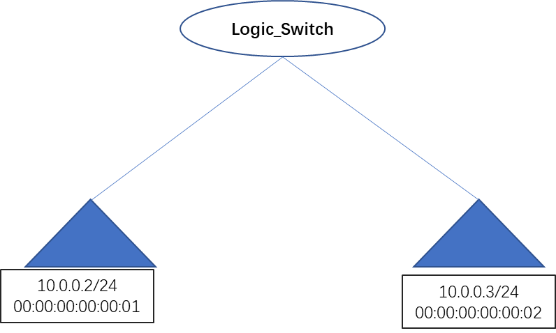
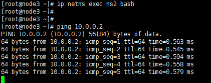

### 1.实验拓扑如下


### 2.创建逻辑交换机
```azure
ovn-nbctl ls-add sw0

ovn-nbctl lsp-add sw0 port11
ovn-nbctl lsp-set-addresses port11 02:ac:10:ff:00:01
ovn-nbctl lsp-set-port-security port11 02:ac:10:ff:00:01

ovn-nbctl lsp-add sw0 port12
ovn-nbctl lsp-set-addresses port12 02:ac:10:ff:00:02
ovn-nbctl lsp-set-port-security port12 02:ac:10:ff:00:02
```

### 3.用network namespace模拟两个虚机
```azure
#vm1(node1上)
ovs-vsctl add-port br-int vmport11 -- set interface vmport11 type=internal -- set interface vmport11 external_ids:iface-id=port11
ip netns add ns1
ip link set vmport11 netns ns1
ip netns exec ns1 ip link set vmport11 up
ip netns exec ns1 ip link set vmport11 address 02:ac:10:ff:00:01
ip netns exec ns1 ip addr add 10.0.0.2/24 dev vmport11
    
#vm2(node3上)
ovs-vsctl add-port br-int vmport12 -- set interface vmport12 type=internal -- set interface vmport12 external_ids:iface-id=port12
ip netns add ns2
ip link set vmport12 netns ns2
ip netns exec ns2 ip link set vmport12 up
ip netns exec ns2 ip link set vmport12 address 02:ac:10:ff:00:02
ip netns exec ns2 ip addr add 10.0.0.3/24 dev vmport12
```

### 4.从vm2 ping vm1


### 5.环境清理
```
#node3
ip netns del ns2
ovs-vsctl del-port vmport12

#node1
ip netns del ns1
ovs-vsctl del-port vmport11
ovn-nbctl lsp-del port11
ovn-nbctl lsp-del port12
ovn-nbctl ls-del sw0
```
