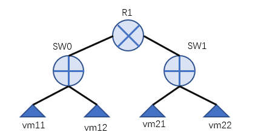
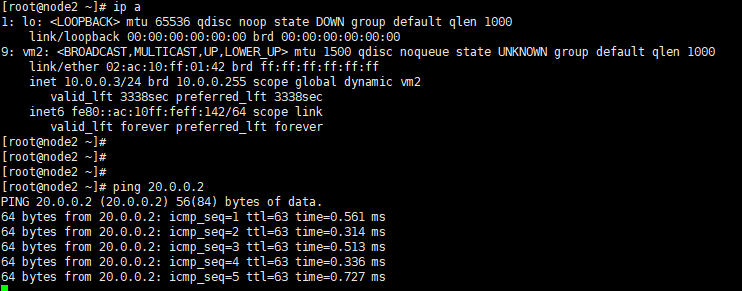

### 1.实验topo


### 2.添加两个逻辑交换机
    ovn-nbctl ls-add sw0
    ovn-nbctl ls-add sw1

### 3.添加路由器
    ovn-nbctl lr-add r1
    #为r1添加一个连接到sw0的port
    ovn-nbctl lrp-add r1 r1-sw0 02:ac:10:ff:01:29 10.0.0.1/24
    #为sw0添加一个连接到r1的port
    ovn-nbctl lsp-add sw0 sw0-r1
    ovn-nbctl lsp-set-type sw0-r1 router 
    ovn-nbctl lsp-set-addresses sw0-r1 02:ac:10:ff:01:29
    ovn-nbctl lsp-set-options sw0-r1 router-port=r1-sw0

    #为r1添加一个连接到sw1的port
    ovn-nbctl lrp-add r1 r1-sw1 02:ac:10:ff:01:30 20.0.0.1/24
    #为sw1添加一个连接到r1的port
    ovn-nbctl lsp-add sw1 sw1-r1
    ovn-nbctl lsp-set-type sw1-r1 router 
    ovn-nbctl lsp-set-addresses sw1-r1 02:ac:10:ff:01:30
    ovn-nbctl lsp-set-options sw1-r1 router-port=r1-sw1

### 4.添加dhcp配置
```
ovn-nbctl set logical_switch sw0 \
  other_config:subnet="10.0.0.0/24" \
  other_config:exclude_ips="10.0.0.2..10.0.0.99"
 
CIDR_UUIDSW0=$(ovn-nbctl create dhcp_options \
  cidr=10.0.0.0/24 \
  options='"lease_time"="3600" "router"="10.0.0.1" "server_id"="10.0.0.1" "server_mac"="02:ac:10:ff:01:29"')
echo $CIDR_UUIDSW0
 
ovn-nbctl set logical_switch sw1 \
  other_config:subnet="20.0.0.0/24" \
  other_config:exclude_ips="20.0.0.2..20.0.0.99"
 
CIDR_UUIDSW1=$(ovn-nbctl create dhcp_options \
  cidr=20.0.0.0/24 \
  options='"lease_time"="3600" "router"="20.0.0.1" "server_id"="20.0.0.1" "server_mac"="02:ac:10:ff:01:30"')
echo $CIDR_UUIDSW1
```

### 5.为逻辑交换机端口绑定dhcp选项
```
ovn-nbctl lsp-add sw0 vmport11
ovn-nbctl lsp-set-addresses vmport11 "02:ac:10:ff:01:41 dynamic"
ovn-nbctl lsp-set-dhcpv4-options vmport11 $CIDR_UUIDSW0

ovn-nbctl lsp-add sw0 vmport12
ovn-nbctl lsp-set-addresses vmport12 "02:ac:10:ff:01:42 dynamic"
ovn-nbctl lsp-set-dhcpv4-options vmport12 $CIDR_UUIDSW0

ovn-nbctl lsp-add sw1 vmport21
ovn-nbctl lsp-set-addresses vmport21 "02:ac:10:ff:01:94 dynamic"
ovn-nbctl lsp-set-dhcpv4-options vmport21 $CIDR_UUIDSW1

ovn-nbctl lsp-add sw1 vmport22
ovn-nbctl lsp-set-addresses vmport22 "02:ac:10:ff:01:95 dynamic"
ovn-nbctl lsp-set-dhcpv4-options vmport22 $CIDR_UUIDSW1
```

### 6.配置虚拟机
```
#node1上
ip netns add vm1
ovs-vsctl add-port br-int vm1 -- set interface vm1 type=internal
ip link set vm1 address 02:ac:10:ff:01:41
ip link set vm1 netns vm1
ovs-vsctl set Interface vm1 external_ids:iface-id=vmport11
ip netns exec vm1 dhclient vm1
ip netns exec vm1 ip addr show vm1
ip netns exec vm1 ip route show

#node2上
ip netns add vm2
ovs-vsctl add-port br-int vm2 -- set interface vm2 type=internal
ip link set vm2 address 02:ac:10:ff:01:42
ip link set vm2 netns vm2
ovs-vsctl set Interface vm2 external_ids:iface-id=vmport12
ip netns exec vm2 dhclient vm2
ip netns exec vm2 ip addr show vm2
ip netns exec vm2 ip route show

#node3上
ip netns add vm3
ovs-vsctl add-port br-int vm3 -- set interface vm3 type=internal
ip link set vm3 address 02:ac:10:ff:01:94
ip link set vm3 netns vm3
ovs-vsctl set Interface vm3 external_ids:iface-id=vmport21
ip netns exec vm3 dhclient vm3
ip netns exec vm3 ip addr show vm3
ip netns exec vm3 ip route show
```

### 7.结果(从vm2 ping vm3)


### 8.环境清理
```
#node3
ip netns del vm3
ovs-vsctl del-port vm3

#node2
ip netns del vm2
ovs-vsctl del-port vm2

#node1
ip netns del vm1
ovs-vsctl del-port vm1
ovn-nbctl ls-del sw0
ovn-nbctl ls-del sw1
ovn-nbctl lr-del r1
ovn-nbctl dhcp-options-del 4d7797dd-6e5d-41ef-bf00-f171fc3d4882
ovn-nbctl dhcp-options-del 43522430-1fc2-49a4-8a35-8c9486ad9e87
```