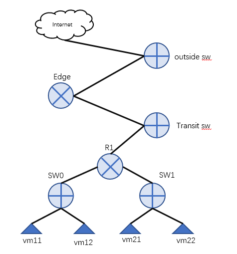

### 1. 实验topo


### 2.参考L3实验，搭建租户网络

### 3.创建edgerouter, edgerouter需要绑定一个特定的chassis, 首先需要找到chassis id
```
[root@node1 ~]# ovn-sbctl show
Chassis "7cfee944-808c-46c7-a306-2b7a8b5336a2"
    hostname: "node1"
    Encap geneve
        ip: "192.168.91.128"
        options: {csum="true"}
    Port_Binding "vmport11"
Chassis "5c5f30e1-bbcc-438f-9110-1b0f8f8d1a2b"
    hostname: "node2"
    Encap geneve
        ip: "192.168.91.129"
        options: {csum="true"}
    Port_Binding "vmport12"
Chassis "50b3e913-f13e-4ab5-8848-491fd4b216b7"
    hostname: "node3"
    Encap geneve
        ip: "192.168.91.130"
        options: {csum="true"}
```
这里我们选择node1

```
ovn-nbctl create Logical_Router name=edge1 options:chassis=7cfee944-808c-46c7-a306-2b7a8b5336a2

#创建连接edge1和tenant1 routers的逻辑交换机transit
ovn-nbctl ls-add transit
# edge1 到 the transit switch
ovn-nbctl lrp-add edge1 edge1-transit 02:ac:10:ff:00:01 172.16.255.1/30
ovn-nbctl lsp-add transit transit-edge1
ovn-nbctl lsp-set-type transit-edge1 router
ovn-nbctl lsp-set-addresses transit-edge1 02:ac:10:ff:00:01
ovn-nbctl lsp-set-options transit-edge1 router-port=edge1-transit

# tenant1 到the transit switch
ovn-nbctl lrp-add r1 r1-transit 02:ac:10:ff:00:02 172.16.255.2/30
ovn-nbctl lsp-add transit transit-r1
ovn-nbctl lsp-set-type transit-r1 router
ovn-nbctl lsp-set-addresses transit-r1 02:ac:10:ff:00:02
ovn-nbctl lsp-set-options transit-r1 router-port=r1-transit

#添加静态路由
ovn-nbctl lr-route-add edge1 "10.0.0.0/24" 172.16.255.2
ovn-nbctl lr-route-add edge1 "10.0.0.0/24" 172.16.255.2
ovn-nbctl lr-route-add r1 "0.0.0.0/0" 172.16.255.1
```

### 4.创建outside交换机，连接edge router和外部网络
```
#在路由器 'edge1'创建新的端口
ovn-nbctl lrp-add edge1 edge1-outside 02:0a:7f:00:01:29 192.168.63.180/24
 
# 新建逻辑交换机，并将它连接到edge1
ovn-nbctl ls-add outside
ovn-nbctl lsp-add outside outside-edge1
ovn-nbctl lsp-set-type outside-edge1 router
ovn-nbctl lsp-set-addresses outside-edge1 02:0a:7f:00:01:29
ovn-nbctl lsp-set-options outside-edge1 router-port=edge1-outside

# 为 eth0新建OVS网桥
ovs-vsctl add-br br-eth0

# 为 eth1创建网桥映射： 把 "dataNet" 映射到 br-eth0
ovs-vsctl set Open_vSwitch . external-ids:ovn-bridge-mappings=dataNet:br-eth0

#在 'outside'交换机创建localnet端口。把网络名称设置为"dataNet"
ovn-nbctl lsp-add outside outside-localnet
ovn-nbctl lsp-set-addresses outside-localnet unknown
ovn-nbctl lsp-set-type outside-localnet localnet
ovn-nbctl lsp-set-options outside-localnet network_name=dataNet

# 将 eth0 连接到 br-eth0
ovs-vsctl add-port br-eth0 eth0
```

### 5.创建SNAT规则和默认路由
```
ovn-nbctl -- --id=@nat create nat type="snat" logical_ip=10.0.0.0/24 external_ip=192.168.63.180 -- add logical_router edge1 nat @nat
ovn-nbctl -- --id=@nat create nat type="snat" logical_ip=20.0.0.0/24 external_ip=192.168.63.180 -- add logical_router edge1 nat @nat

ovn-nbctl lr-route-add edge1 "0.0.0.0/0" 192.168.63.2
```