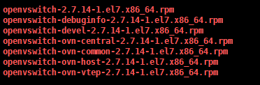

### 1.下载源码

```
https://github.com/openvswitch/ovs/blob/v2.10.0/Documentation/intro/install/general.rs
https://github.com/openvswitch/ovs/blob/v2.10.0/Documentation/intro/install/fedora.rst

yum install -y wget  
mkdir -p /opt/ovs
cd /opt/ovs
```

### 2. 安装构建RPM包所需要的依赖包
```azure
yum install -y  @'Development Tools' rpm-build yum-utils
```

### 3. 安装依赖环境
```azure
yum install -y wget firewalld-filesystem net-tools desktop-file-utils groff graphviz selinux-policy-devel python-sphinx python-twisted-core python-zope-interface python-six libcap-ng-devel unbound unbound-devel openssl-devel gcc make python-devel openssl-devel kernel-devel kernel-debug-devel autoconf automake rpm-build redhat-rpm-config libtool python-openvswitch  libpcap-devel numactl-devel dpdk-devel
```

### 4. 安装引导脚本
```azure
./boot.sh
```

### 5. 配置
```azure
./configure
```

### 6. 构建
```azure
 make rpm-fedora RPMBUILD_OPT="--without check"
```

### 7.安装
```azure
这里根据实际情况选择,计算节点上不需要安装openvswitch-ovn-central包
```


### 8.启动服务
```azure
systemctl enable  openvswitch
systemctl enable  ovn-northd
systemctl enable ovn-controller

systemctl start  openvswitch
systemctl start  ovn-northd
systemctl start ovn-controller

systemctl  status  openvswitch
systemctl  status  ovn-northd
systemctl  status  ovn-controller
```

### 9.ovs连接ovn
```azure
ovn-nbctl set-connection ptcp:6641:0.0.0.0
ovn-sbctl set-connection ptcp:6642:0.0.0.0

ovs-vsctl set open . external-ids:ovn-remote=tcp:{controoler_ip}:6442
ovs-vsctl set open . external-ids:ovn-encap-type=geneve #配置vtep类型
ovs-vsctl set open . external-ids:ovn-encap-ip={local_ip}  #配置本地vtep ip地址
```
